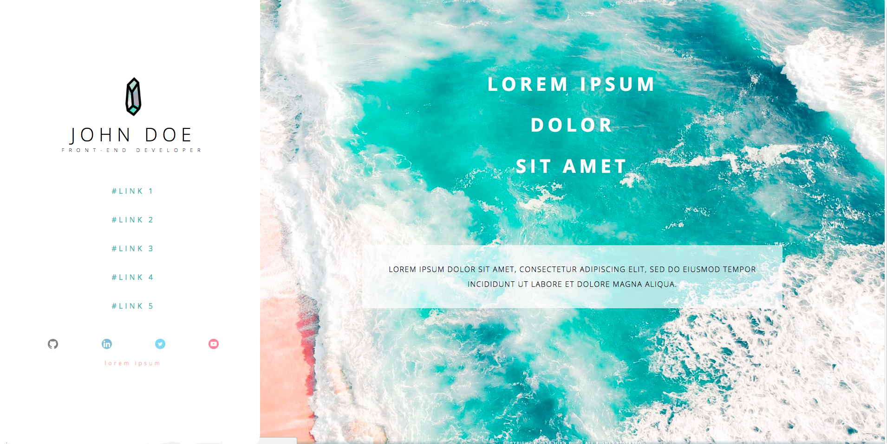

# HTML/CSS Lecture

## Complementary Material
- [1. HTML Fundamentals](pages/web-html.md)
- [2. CSS Fundamentals](pages/web-css.md)

## Exercice 1: Recreate the Tesla Roadster Website.

#### Homework:
1. Add the menu/navbar with HTML/CSS
2. Restructure the page with a `<main>` tag and add the styles body there.
3. Make the page responsive (look at the website)
4. Create the next section of the official without any animations.
5. Use the tag `<video>`
6. Don't use ID's, and add a Class for each element that create a new context (it will help to organize your CSS later).
7. Validate your code on W3C: http://validator.w3.org/

## Challenge:

**colors**: BLUE(`#17a5a7`) and SALMON(`#ffafb0`)

1. Create the portifolio with your own information
2. Use the font [Lato](https://fonts.google.com/specimen/Lato) on the project
3. Use `text-shadow` in your amazing phrase
4. Use a `background-color` with alpha (RGBA function).
5. [Publish on Github Pages](https://pages.github.com/).
